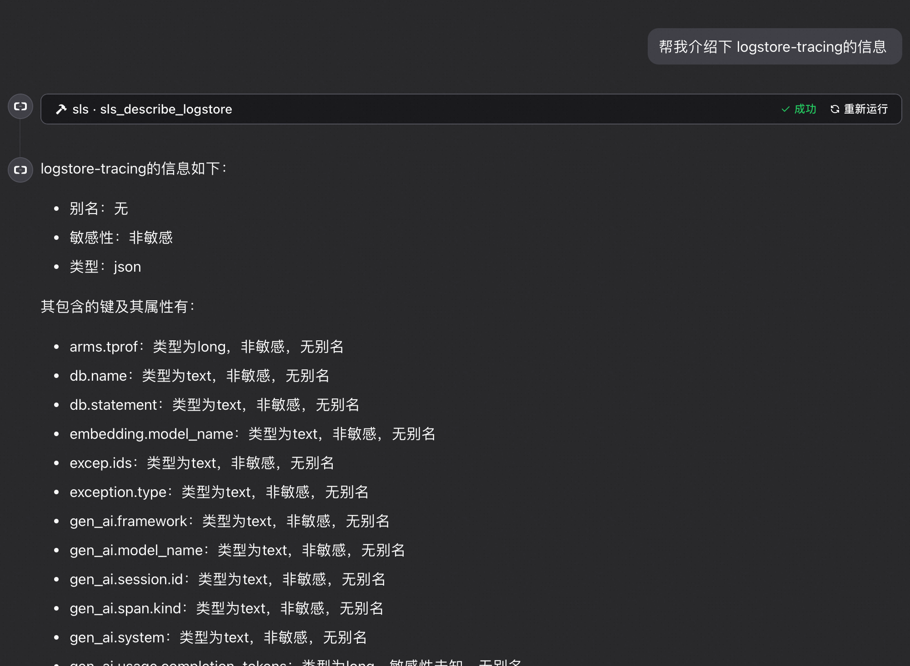
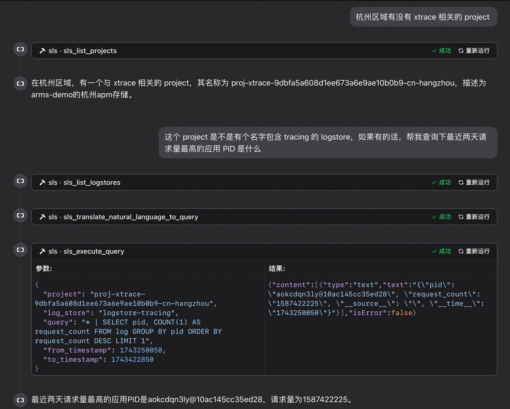
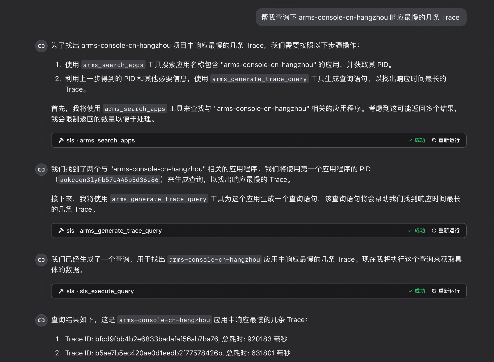
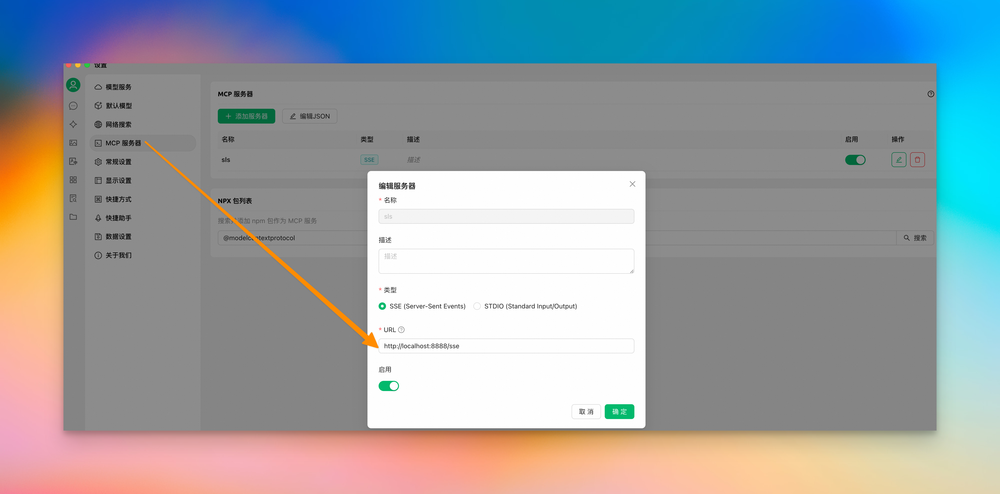
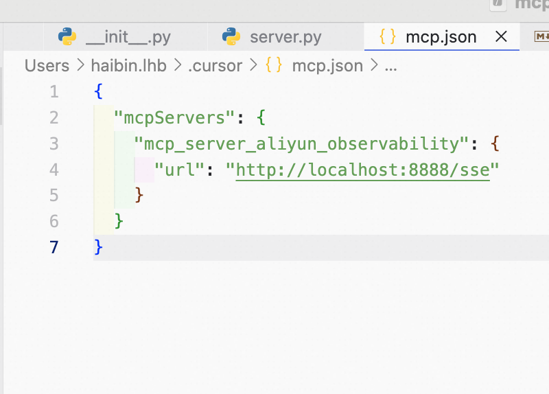
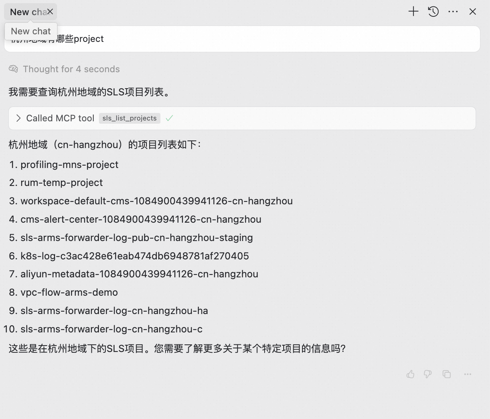

## 阿里云可观测MCP服务

### 简介

阿里云可观测 MCP服务，提供了一系列访问阿里云可观测各产品的工具能力，覆盖产品包含阿里云日志服务SLS、阿里云应用实时监控服务ARMS、阿里云云监控等，任意支持 MCP 协议的智能体助手都可快速接入。支持的产品如下:

- [阿里云日志服务SLS](https://help.aliyun.com/zh/sls/product-overview/what-is-log-service)
- [阿里云应用实时监控服务ARMS](https://help.aliyun.com/zh/arms/?scm=20140722.S_help@@%E6%96%87%E6%A1%A3@@34364._.RL_arms-LOC_2024NSHelpLink-OR_ser-PAR1_215042f917434789732438827e4665-V_4-P0_0-P1_0)

目前提供的 MCP 工具以阿里云日志服务为主，其他产品会陆续支持，工具详细如下:

### 版本记录

#### 0.1.3
- 优化各个工具的描述信息，使得模型更加容易识别

#### 0.1.1
本次发布版本为 0.1.1，以新增工具为主，主要包含 SLS 日志服务和 ARMS 应用实时监控服务相关工具。

##### 工具列表

- 增加 SLS 日志服务相关工具
    - `sls_describe_logstore`
        - 获取 SLS Logstore 的索引信息
    - `sls_list_projects`
        - 获取 SLS 项目列表
    - `sls_list_logstores`
        - 获取 SLS Logstore 列表
    - `sls_describe_logstore`
        - 获取 SLS Logstore 的索引信息
    - `sls_execute_query`
        - 执行SLS 日志查询
    - `sls_translate_natural_language_to_query`
        - 翻译自然语言为SLS 查询语句

- 增加 ARMS 应用实时监控服务相关工具
    - `arms_search_apps`
        - 搜索 ARMS 应用
    - `arms_generate_trace_query`
        - 根据自然语言生成 trace 查询语句

##### 场景举例

- 场景一: 快速查询某个 logstore 相关结构
    - 使用工具:
        - `sls_list_logstores`
        - `sls_describe_logstore`
    


- 场景二: 模糊查询最近一天某个 logstore下面访问量最高的应用是什么
    - 分析:
        - 需要判断 logstore 是否存在
        - 获取 logstore 相关结构
        - 根据要求生成查询语句(对于语句用户可确认修改)
        - 执行查询语句
        - 根据查询结果生成响应
    - 使用工具:
        - `sls_list_logstores`
        - `sls_describe_logstore`
        - `sls_translate_natural_language_to_query`
        - `sls_execute_query`
    

    
- 场景三: 查询 ARMS 某个应用下面响应最慢的几条 Trace
    - 分析:
        - 需要判断应用是否存在
        - 获取应用相关结构
        - 根据要求生成查询语句(对于语句用户可确认修改)
        - 执行查询语句
        - 根据查询结果生成响应
    - 使用工具:
        - `arms_search_apps`
        - `arms_generate_trace_query`
        - `sls_translate_natural_language_to_query`
        - `sls_execute_query`
    


### 使用说明

在使用 MCP Server 之前，需要先获取阿里云的 AccessKeyId 和 AccessKeySecret，请参考 [阿里云 AccessKey 管理](https://help.aliyun.com/document_detail/53045.html)


#### 使用 pip 安装

直接使用 pip 安装即可，安装命令如下：

```bash
pip install mcp-server-aliyun-observability
```
安装之后，直接运行即可，运行命令如下：

```bash
python -m mcp_server_aliyun_observability --transport sse --access-key-id <your_access_key_id> --access-key-secret <your_access_key_secret>
```
可通过命令行传递指定参数:
- `--transport` 指定传输方式，可选值为 `sse` 或 `stdio`，默认值为 `stdio`
- `--access-key-id` 指定阿里云 AccessKeyId
- `--access-key-secret` 指定阿里云 AccessKeySecret
- `--log-level` 指定日志级别，可选值为 `DEBUG`、`INFO`、`WARNING`、`ERROR`，默认值为 `INFO`
- `--transport-port` 指定传输端口，默认值为 `8000`,仅当 `--transport` 为 `sse` 时有效


### 从源码安装

```bash
# clone 源码
cd src/mcp_server_aliyun_observability
# 安装
pip install -e .
# 运行
python -m mcp_server_aliyun_observability --transport sse --access-key-id <your_access_key_id> --access-key-secret <your_access_key_secret>
```


### AI 工具集成
> 以 SSE 启动方式为例
#### Cherry Studio集成




#### Cursor集成







